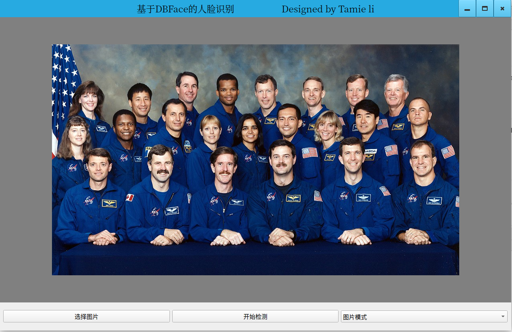
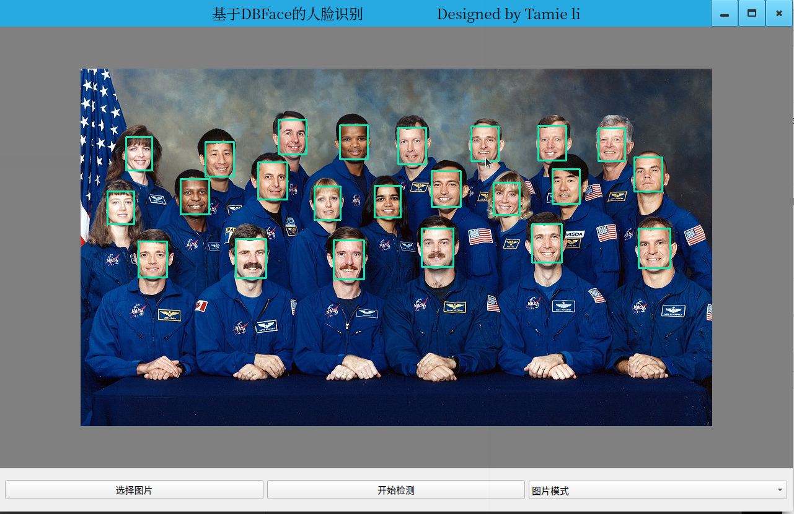
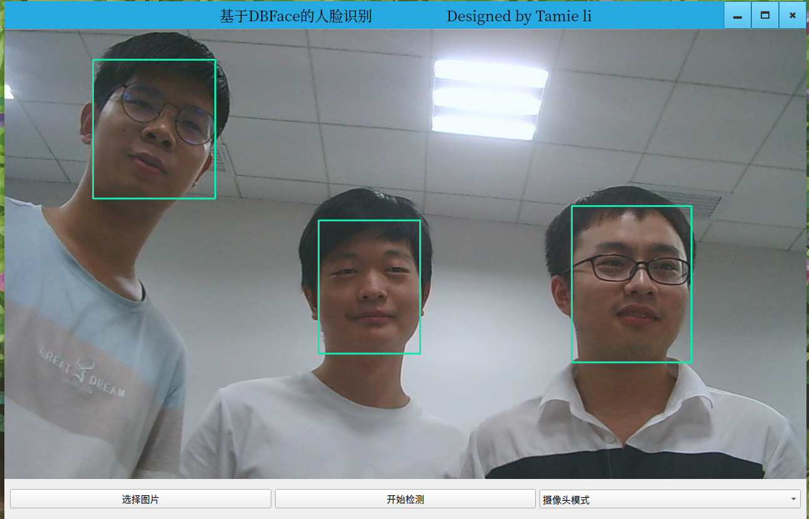

# DBFace 
DBFace is a real-time, single-stage detector for face detection, with faster speed and higher accuracy

#Version requirements
python ==3.6

pyqt == 5.12

opencv-python == 4.0.1.24

QtAwesome == 0.7.2

torchvision==0.7.0
# Our work

We use the DBFace model proposed by DeepBlue Technology to build a face recognition platform.

The GUI part is developed by Pyqt5

#Result
## Picture mode

Before processing

After processing

---
## Camera mode

## QQ

2908689598

 

## Author
- [Tammie-Li](https://github.com/Tammie-Li)

## References

1. Hamid Rezatofighi1, Generalized Intersection over Union: A Metric and A Loss for Bounding Box Regression：https://arxiv.org/abs/1902.09630

2. Xingyi Zhou, Objects as Points：https://arxiv.org/abs/1904.07850

3. Zili Liu, Training-Time-Friendly Network for Real-Time Object Detection：https://arxiv.org/abs/1909.00700

4. Zhen-Hua Feng, Wing Loss for Robust Facial Landmark Localisation with Convolutional Neural Networks: https://arxiv.org/abs/1711.06753v4

5. Mahyar Najib, SSH: Single Stage Headless Face Detector: https://arxiv.org/abs/1708.03979

6. MobileNet: https://github.com/xiaolai-sqlai/mobilenetv3
